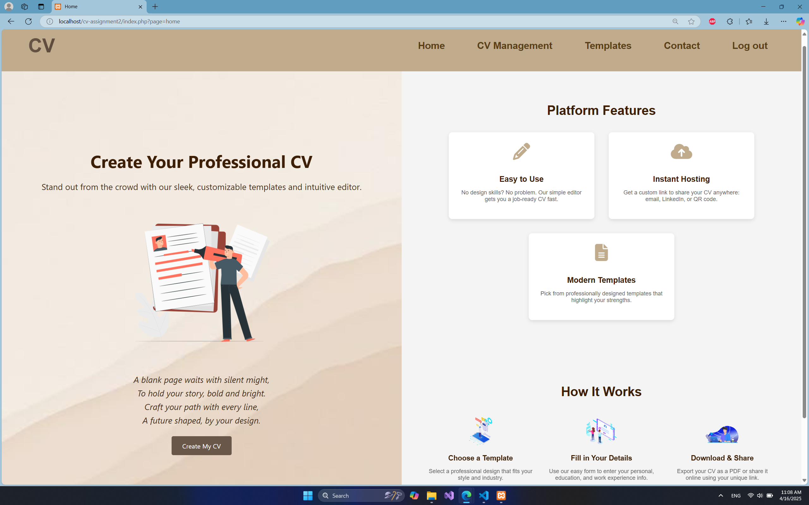
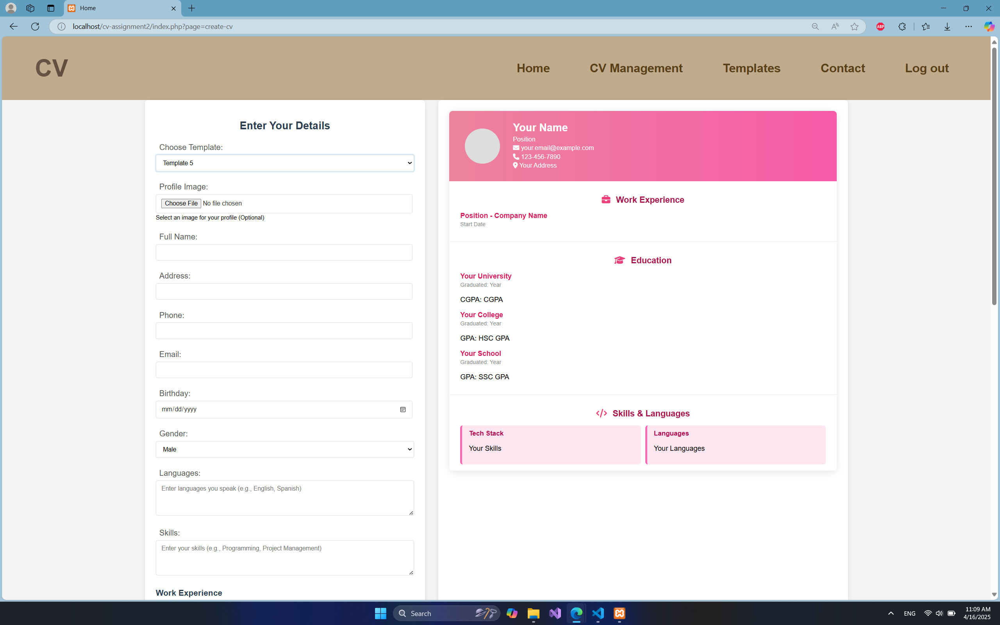
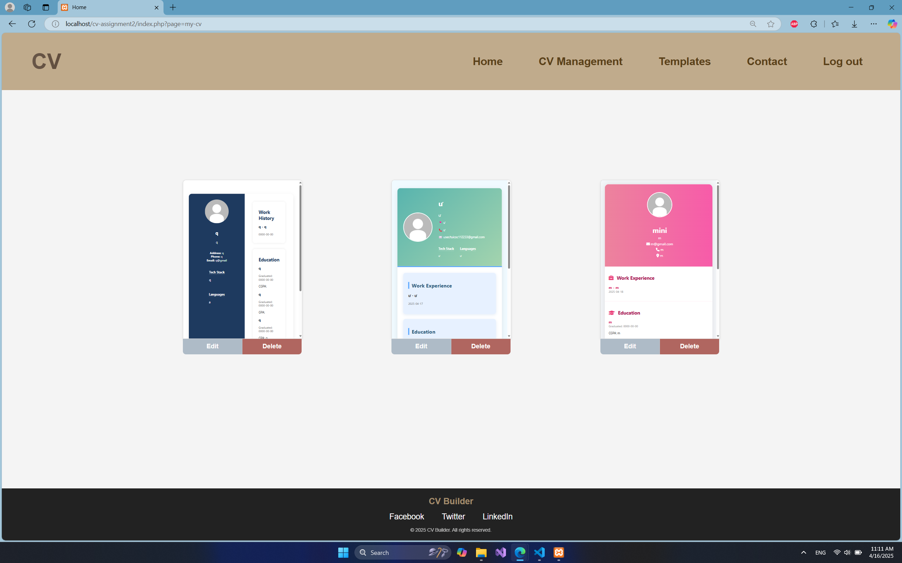
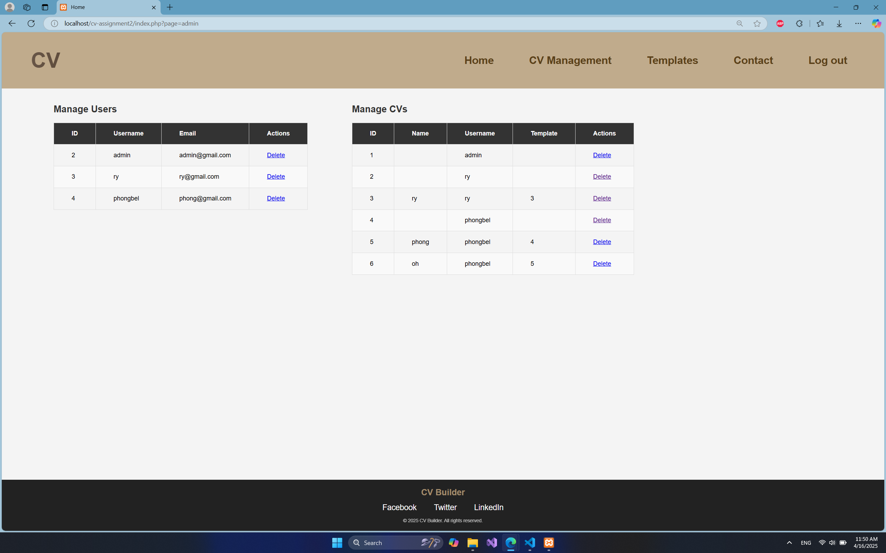

# CV Builder — Web-Based CV Creation and Hosting App

A PHP/MySQL web app for building a CV from templates and hosting it at a shareable link. Built for **Web Programming (CO3049)** at HCMUT.

## Features
- Sign up / log in, create and edit CVs with a live preview
- Multiple templates with profile photo upload
- Each CV gets a unique public URL (no login needed to view)
- Admin dashboard to manage users and CVs

## Screenshots

## Tech Stack
PHP · MySQL · HTML/CSS · Bootstrap · JavaScript

## Database
- `login` — id, username, email, password (bcrypt), role
- `cv_info` — CV content fields + `username` (FK to `login`) + `template`

## Setup
1. Clone into your server's web root (e.g. `htdocs/` for XAMPP)
2. Create a MySQL database and import the `login` and `cv_info` tables
3. Set your DB credentials in the config file
4. Start Apache + MySQL, then visit `http://localhost/cv-assignment2/index.php?page=home`
